# 🌍 EarthIQ — Intelligent Climate Companion

> Understand your impact. Discover your biggest opportunity. Take meaningful action.

EarthIQ is an AI-powered climate intelligence platform that helps individuals understand, prioritize, and reduce their carbon footprint through personalized recommendations, transparent reasoning, and AI-guided action plans.

Unlike traditional carbon calculators that generate generic advice, EarthIQ combines explainable decision intelligence, sustainability planning, and conversational AI to help users make informed climate decisions based on their unique lifestyle, goals, budget, and effort preferences.

---

## 🚀 Live Demo

**Live Application:** https://earth-iq.vercel.app

**Repository:** https://github.com/Tejas-H01/EarthIQ

---

# 🎯 Problem Statement

Climate change is one of the defining challenges of our generation.

While many people want to live more sustainably, most carbon footprint tools fail because they:

- Provide generic recommendations
- Focus only on raw numbers
- Lack personalization
- Do not explain why recommendations were chosen
- Offer no structured path toward improvement
- Fail to create long-term engagement

Users are often left asking:

> "What should I actually do first?"

and

> "Why is this recommendation relevant to me?"

EarthIQ solves this problem by transforming sustainability data into personalized, explainable intelligence.

---

# 💡 Solution

EarthIQ is a climate intelligence companion.

The platform:

1. Collects lifestyle and sustainability information through an assessment
2. Calculates a personalized carbon footprint
3. Detects the user's highest-impact emission hotspot
4. Generates context-aware recommendations
5. Explains why those recommendations were selected
6. Builds a structured 30-day improvement plan
7. Provides an AI sustainability coach powered by Google Gemini
8. Tracks progress over time through authenticated user journeys

The result is a personalized sustainability experience designed to promote long-term behavioral change.

---

# ✨ Core Features

## 🌱 Personalized Carbon Assessment

Users complete a guided assessment covering:

- Transportation
- Home Energy Usage
- Food & Diet
- Lifestyle & Consumption
- Sustainability Goals

EarthIQ uses these signals to build an individualized sustainability profile.

---

## 🔥 Hotspot Detection

EarthIQ automatically identifies:

- Largest source of emissions
- Percentage contribution
- Highest-leverage improvement area

Example hotspots:

- Transport
- Energy
- Diet
- Lifestyle Consumption

---

## 🧠 Explainable Recommendation Engine

Rather than generating generic advice, EarthIQ ranks actions using multiple signals:

- Carbon Impact
- Budget Compatibility
- Goal Alignment
- Effort Preference
- Sustainability Context

Every recommendation includes:

✅ Why it was selected

✅ Expected impact

✅ Budget compatibility

✅ Effort compatibility

---

## 📖 Mission Control

Mission Control transforms sustainability data into a story-driven experience.

Users receive:

- Carbon Story
- Biggest Opportunity
- Impact Projection
- Recommended Actions
- Confidence Signals
- 30-Day Plan

Rather than overwhelming dashboards, EarthIQ presents intelligence in a human-centered narrative.

---

## 🤖 AI Sustainability Coach

Powered by Google Gemini.

Users can ask:

- Why was this recommendation chosen?
- How can I reduce my footprint faster?
- What should I focus on this week?
- How does my progress compare over time?

The coach is grounded in EarthIQ's intelligence layer and uses the user's actual assessment results.

---

## 📈 Journey Tracking

Authenticated users can:

- Save assessments
- Track progress
- Review previous plans
- Monitor improvement over time

EarthIQ transforms sustainability into an ongoing journey rather than a one-time calculation.

---

## 🔐 Authentication & Persistence

EarthIQ includes:

- Secure User Registration
- Secure Login
- Session Persistence
- Supabase Authentication
- User-specific data storage
- Row Level Security (RLS)

Users only have access to their own sustainability records.

---

# 🏗️ Architecture

EarthIQ follows a layered architecture focused on maintainability, testability, and separation of concerns.

```text
Presentation Layer
    ↓
Application Layer
    ↓
Intelligence Layer
    ↓
Persistence Layer
```

---

## Architecture Overview

```text
┌────────────────────────────────────────────┐
│              Presentation Layer            │
│ Assessment • Mission Control • Coach       │
│ Audit Report • Journey                     │
└────────────────────────────────────────────┘
                    │
                    ▼
┌────────────────────────────────────────────┐
│             Application Layer              │
│ EarthIqApplicationService                  │
│ Workflow Orchestration                     │
└────────────────────────────────────────────┘
                    │
                    ▼
┌────────────────────────────────────────────┐
│            Intelligence Layer              │
│ Carbon Engine                              │
│ Hotspot Engine                             │
│ Recommendation Engine                      │
│ Ranking Engine                             │
│ Planner Engine                             │
│ Context Engine                             │
│ Explanation Engine                         │
│ Decision Report Engine                     │
└────────────────────────────────────────────┘
                    │
                    ▼
┌────────────────────────────────────────────┐
│             Persistence Layer              │
│ Supabase                                   │
│ Repositories                               │
│ Authentication                             │
└────────────────────────────────────────────┘
```

---

# 🧠 Intelligence Pipeline

EarthIQ's recommendation system is built from multiple specialized engines.

### 1. Carbon Engine

Calculates annual carbon emissions from:

- Transport
- Energy
- Diet
- Lifestyle

---

### 2. Hotspot Engine

Determines:

- Largest emission source
- Relative contribution

---

### 3. Recommendation Engine

Generates sustainability actions tailored to:

- Profile
- Goals
- Budget
- Effort preferences

---

### 4. Ranking Engine

Prioritizes actions based on:

- Impact
- Cost
- Difficulty
- Goal alignment

---

### 5. Planner Engine

Builds a structured:

**4-week sustainability plan**

with progressive improvement steps.

---

### 6. Context Engine

Creates a unified user profile by combining:

- Assessment signals
- User preferences
- Carbon analysis

---

### 7. Explanation Engine

Generates transparent reasoning for every recommendation.

This enables EarthIQ's:

> "Why EarthIQ Chose This"

feature.

---

### 8. Decision Report Engine

Produces:

- Sustainability Audit
- Key Insights
- Impact Summaries
- Decision Narratives

---

# 🧩 Explainability-First Design

Most recommendation systems only provide answers.

EarthIQ provides reasoning.

Every recommendation includes:

- Hotspot alignment
- Goal alignment
- Budget alignment
- Effort alignment
- Expected impact

Users can clearly understand:

> Why was this recommendation selected for me?

This transparency improves trust and actionability.

---

# 🤖 AI Coach Architecture

The AI Coach follows a controlled architecture.

```text
Question
    ↓
Question Classifier
    ↓
AI Context Builder
    ↓
Prompt Builder
    ↓
Gemini
    ↓
Structured Response
```

The AI coach does not independently calculate emissions or generate plans.

Instead, it explains and communicates decisions already produced by EarthIQ's intelligence layer.

This prevents hallucinated sustainability advice.

---

# 🔒 Security

EarthIQ was built with security in mind.

### Authentication

- Supabase Auth
- Email & Password Login
- Session Management

### Database Security

- Row Level Security (RLS)
- User-scoped access
- Authenticated isolation

### Data Protection

- Environment Variables
- Secure API handling
- No exposed secrets

---

# ♿ Accessibility

EarthIQ includes:

- Semantic HTML
- Keyboard Navigation
- Focus States
- ARIA Labels
- Responsive Design
- Screen Reader Support

Accessibility considerations were integrated throughout the UI design process.

---

# 🧪 Testing

EarthIQ includes automated testing across all major layers.

### Verification Commands

```bash
npm run test
npm run typecheck
npm run build
```

### Coverage Areas

- Carbon Calculations
- Hotspot Detection
- Recommendation Ranking
- Planning Logic
- Explainability Layer
- Persistence Layer
- AI Coach Services
- Application Workflows

All tests pass successfully.

---

# 🛠️ Technology Stack

| Category | Technology |
|-----------|-----------|
| Frontend | Next.js 16 |
| UI | React 19 |
| Language | TypeScript |
| Styling | Tailwind CSS |
| Animation | Framer Motion |
| Database | Supabase |
| Authentication | Supabase Auth |
| AI | Google Gemini |
| Validation | Zod |
| Testing | Vitest |
| Deployment | Vercel |

---

# 📸 Screenshots
## Login & Signup Page
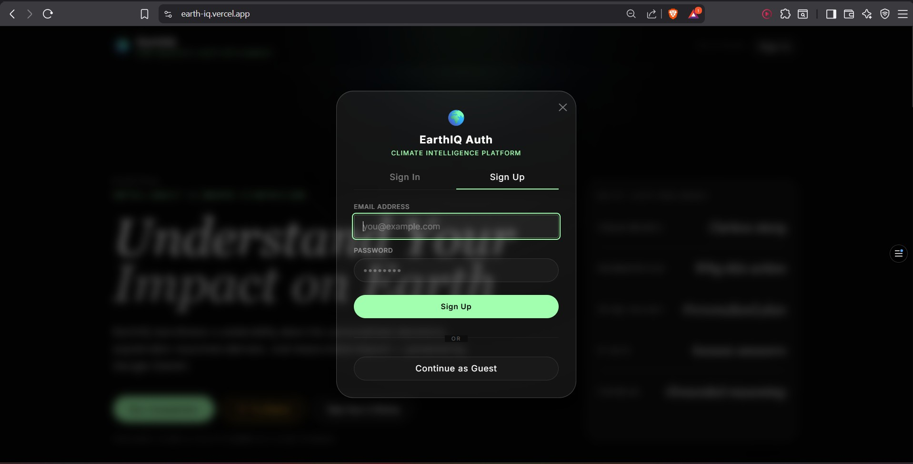

## Landing Page
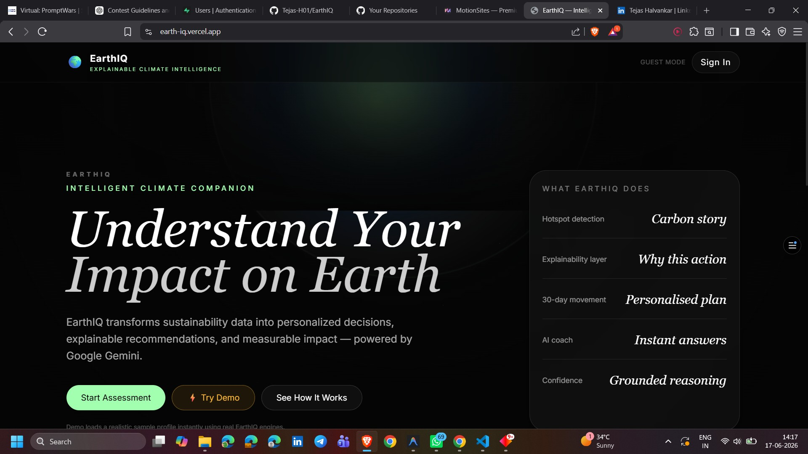


---

## Assessment Experience

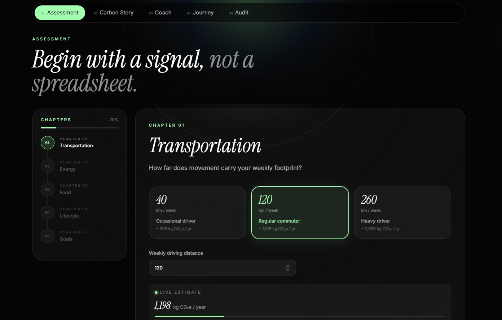

---

## Mission Control

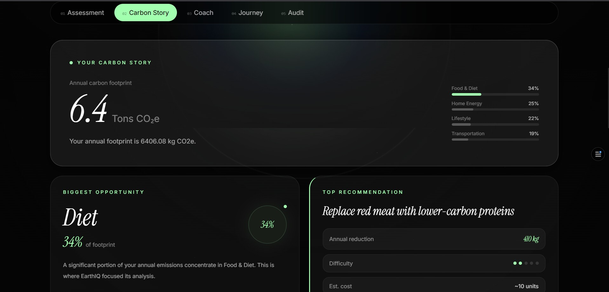
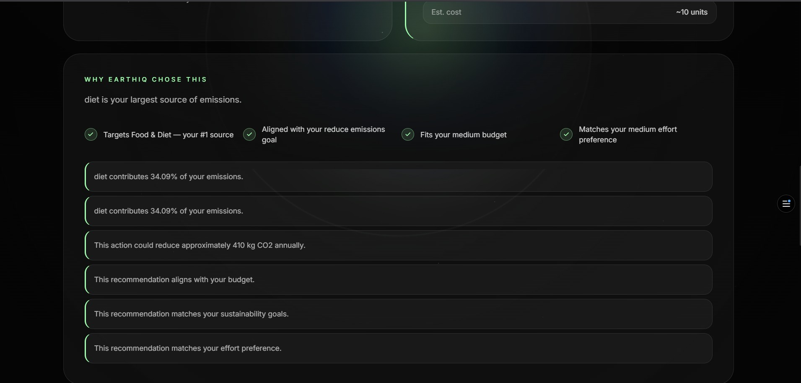
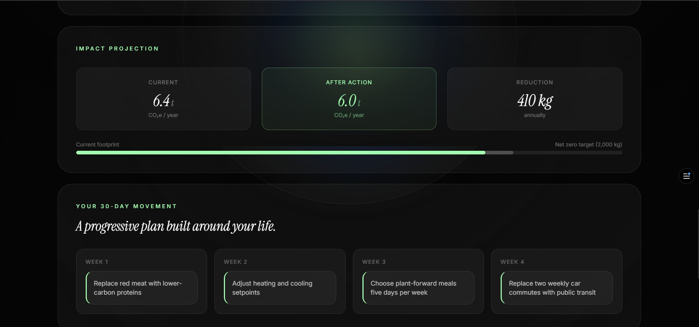
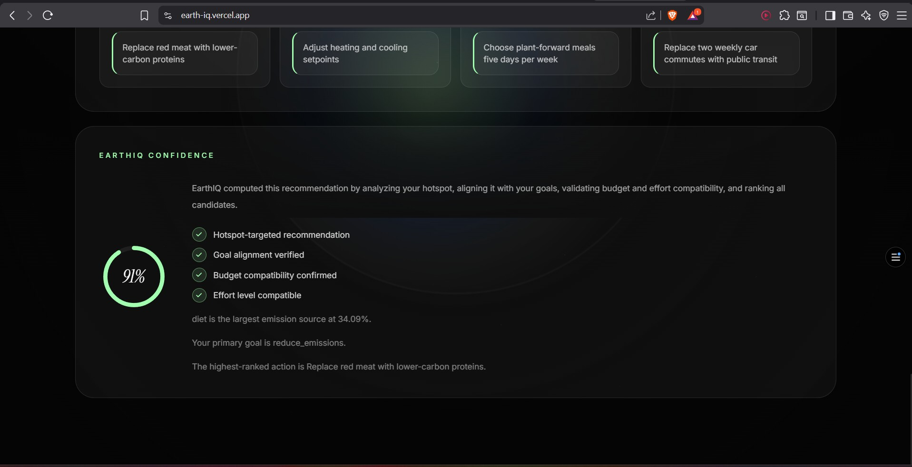


---

## AI Sustainability Coach

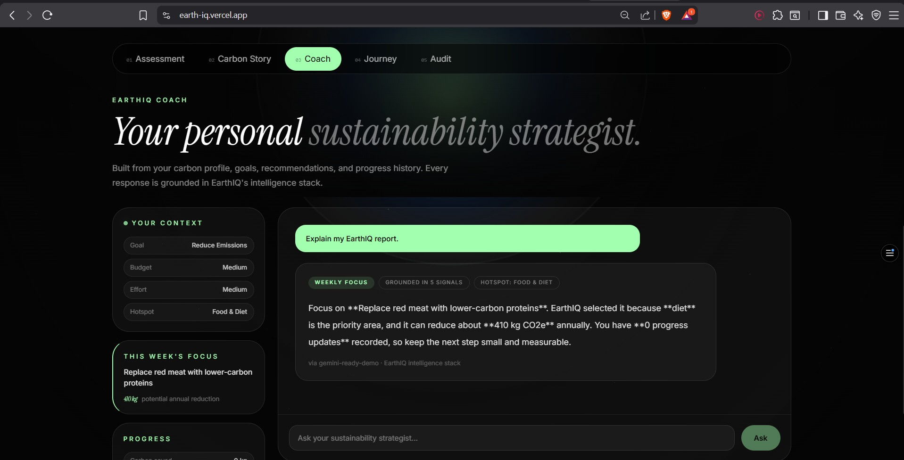


---

## Journey Tracking

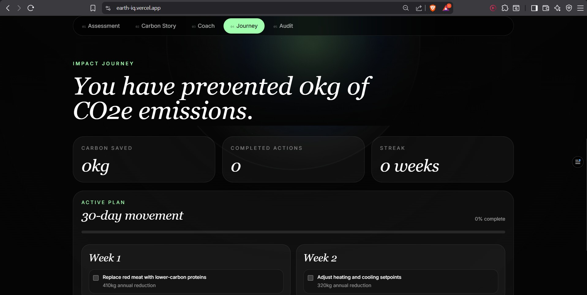
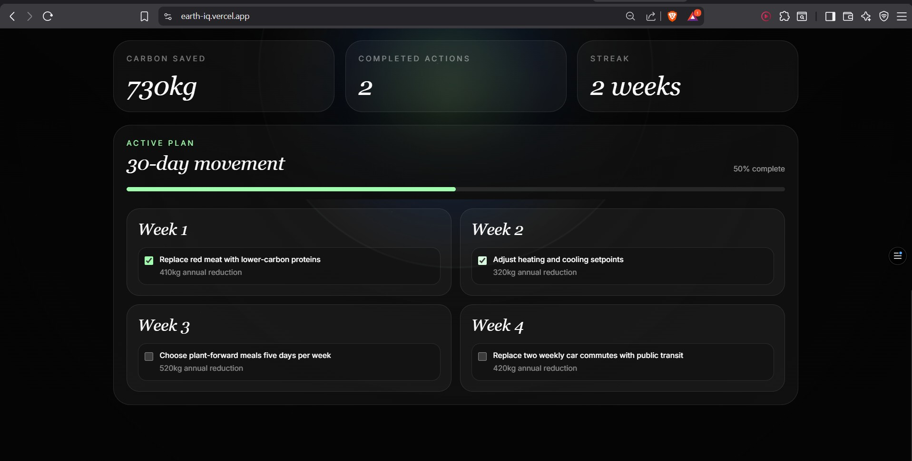

---

## Sustainability Audit

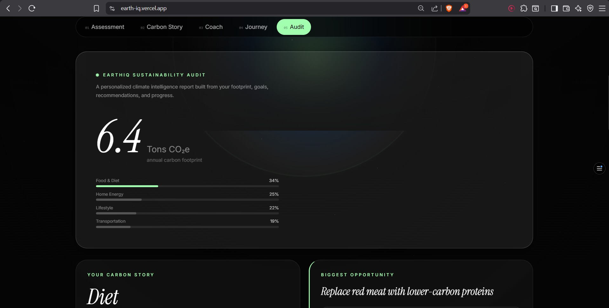
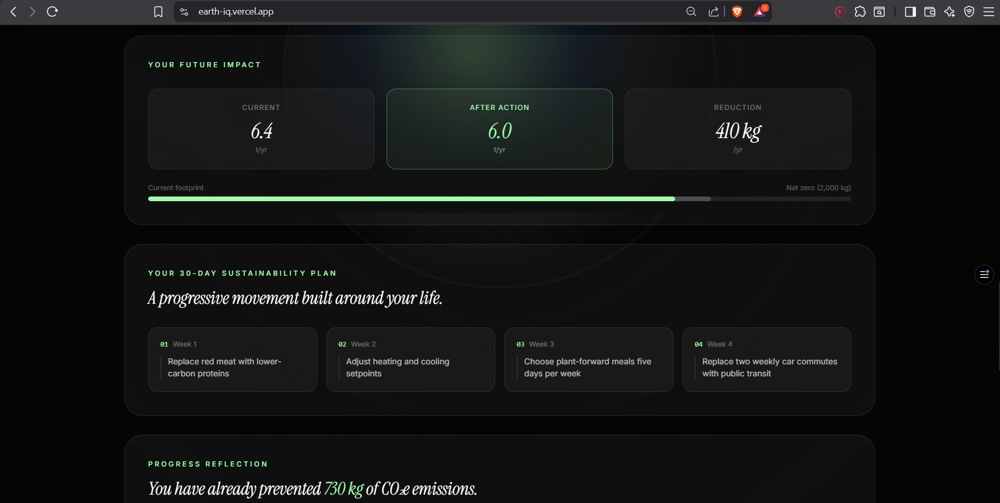
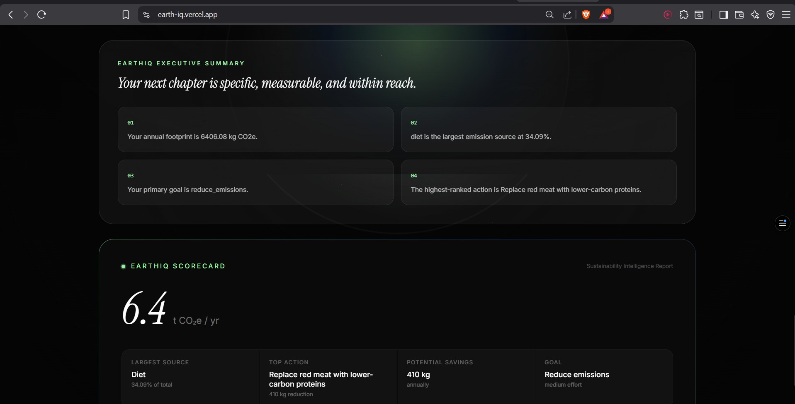


---

# 🚀 Local Setup

## Prerequisites

- Node.js 18+
- Supabase Project
- Google Gemini API Key

---

## Installation

```bash
git clone https://github.com/YOUR_USERNAME/EarthIQ.git

cd EarthIQ

npm install
```

---

## Environment Variables

Create:

```env
.env.local
```

Add:

```env
NEXT_PUBLIC_SUPABASE_URL=your_supabase_url

NEXT_PUBLIC_SUPABASE_ANON_KEY=your_supabase_anon_key

GEMINI_API_KEY=your_gemini_api_key
```

---

## Run Locally

```bash
npm run dev
```

Application:

```text
http://localhost:3000
```

---

## Production Build

```bash
npm run build
```

---

# 🎮 Judge Quick Start

Want to evaluate EarthIQ quickly?

1. Open the live application
2. Create an account or continue as guest
3. Complete the assessment
4. Review Mission Control
5. Ask questions to the AI Coach
6. Explore the Sustainability Audit
7. Track progress in Journey

The complete intelligence pipeline can be experienced in under 2 minutes.

---

# 🌍 Competition Alignment

EarthIQ was designed specifically to demonstrate:

### Smart Dynamic Assistant

✅ AI Sustainability Coach

### Context-Aware Decision Making

✅ Personalized recommendation pipeline

### Real-World Usability

✅ Action plans, progress tracking, persistence

### Code Quality

✅ Layered architecture and strict separation of concerns

### Security

✅ Authentication and Row Level Security

### Testing

✅ Automated validation across business logic layers

### Accessibility

✅ Inclusive design and keyboard navigation

---

# 📌 Future Enhancements

- Advanced sustainability benchmarking
- Community challenges
- Carbon offset integrations
- Weekly AI-generated sustainability reports
- Enhanced progress analytics

---

# 👨‍💻 Developer

**Tejas Halvankar** || LinkedIn: [www.linkedin.com/in/tejashalvankar](https://github.com/Tejas-H01/EarthIQ)

Information Technology Student  
Thadomal Shahani Engineering College (TSEC)

EarthIQ was designed and developed as part of the AI Sustainability Challenge with a focus on explainable climate intelligence, personalized decision-making, and real-world sustainability planning.


---

# 🌱 Vision

Climate change is one of the defining challenges of our generation.

Many people want to live more sustainably but struggle to understand where to begin, which actions matter most, and how to maintain long-term progress.

EarthIQ aims to bridge that gap by transforming sustainability data into clear, explainable decisions. Rather than overwhelming users with numbers and generic advice, EarthIQ provides personalized intelligence, transparent reasoning, and actionable plans that help individuals make meaningful environmental choices.

The long-term vision is to make climate action understandable, accessible, and achievable for everyone.

---

## 🌍 EarthIQ

**Understand Your Impact.  
Discover Your Opportunity.  
Change Your Future.**